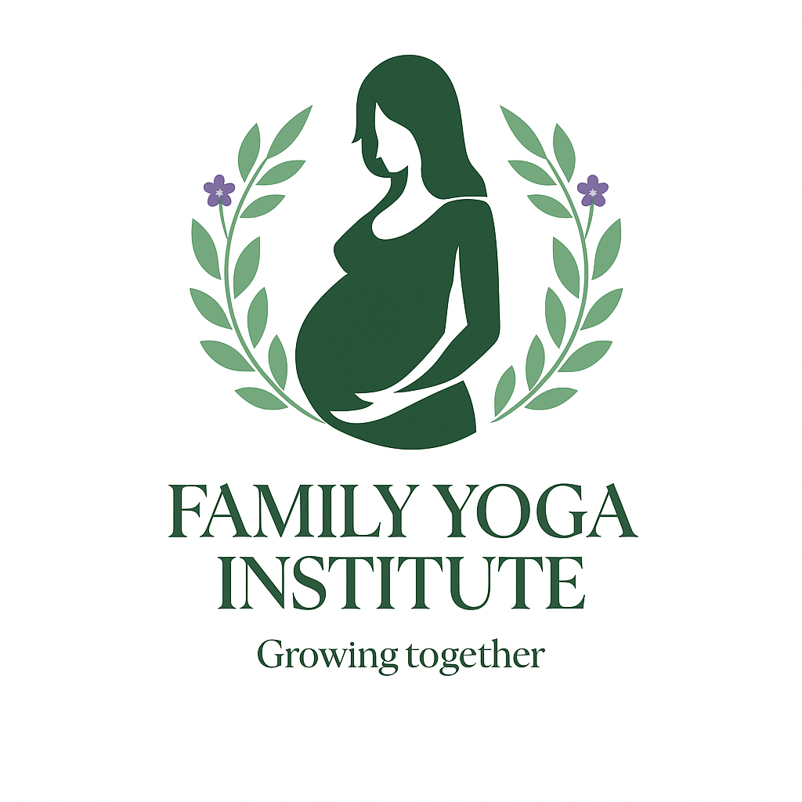

<html lang="en">
<head>
  <meta charset="UTF-8" />
  <meta name="viewport" content="width=device-width, initial-scale=1" />
  <title>Family Yoga Institute – Growing Together</title>
  <meta name="description" content="Family Yoga Institute (FYI): Community-centered yoga for moms, moms-to-be, and little ones." />
  
  
</head>
<body class="min-h-screen bg-gradient-to-b from-teal-50 via-white to-purple-50 text-slate-800">

  <!-- HERO -->
  <section class="relative overflow-hidden">
    

      

        <h1 class="text-4xl md:text-5xl font-bold tracking-tight text-slate-900">Family Yoga Institute</h1>
        
Community-centered yoga for moms, moms-to-be, and little ones — with a focus on mindfulness, connection, and accessible movement.

        
Pending final approval at the September association meeting, our neighborhood will promote classes and provide space. We’re excited to begin soon!

        

          <a href="#classes" class="btn btn-primary">Explore classes</a>
          <a href="#signup" class="btn btn-outline">Join the list</a>
        

      

      

        
      

    

  </section>

  <!-- CLASSES SECTION -->
  <section id="classes" class="mx-auto max-w-6xl px-6 py-16">
    <h2 class="text-3xl font-bold mb-8">Our Classes</h2>
    

      

        <h3 class="text-xl font-semibold text-fyi-green">Mindful Mommy and Me</h3>
        
A gentle yoga flow for moms and their little ones, focusing on connection, breathwork, and movement you can do together.

      

      

        <h3 class="text-xl font-semibold text-fyi-purple">Mindful Mommies To Be</h3>
        
A prenatal yoga class designed to nurture and support expectant moms, with a focus on breath, relaxation, and preparing the body for birth.

      

    

  </section>

  <!-- ABOUT SECTION -->
  <section id="about" class="bg-white py-16">
    

      <h2 class="text-3xl font-bold mb-6">About Us</h2>
      
[About Me and About FYI text will go here – please provide content]

    

  </section>

  <!-- FAQ SECTION -->
  <section id="faq" class="mx-auto max-w-4xl px-6 py-16">
    <h2 class="text-3xl font-bold mb-6">FAQ</h2>
    
[FAQ answers will go here – please provide content]

  </section>

  <!-- SIGN UP -->
  <section id="signup" class="bg-gradient-to-r from-fyi-green to-fyi-teal py-16">
    

      <h2 class="text-3xl font-bold mb-4">Sign up for a class</h2>
      <a id="fyi-form" href="#" class="btn bg-white text-fyi-green font-bold">Sign Up Form</a>
    

  </section>

  <!-- FOOTER -->
  <footer class="bg-slate-900 text-white py-8 mt-12">
    

      

        <h3 class="font-bold mb-2">Contact</h3>
        
Email: 

        
Phone: 

      

      

        <h3 class="font-bold mb-2">Location</h3>
        

      

      

        
&copy;  Family Yoga Institute

      

    

  </footer>

  

</body>
</html>

